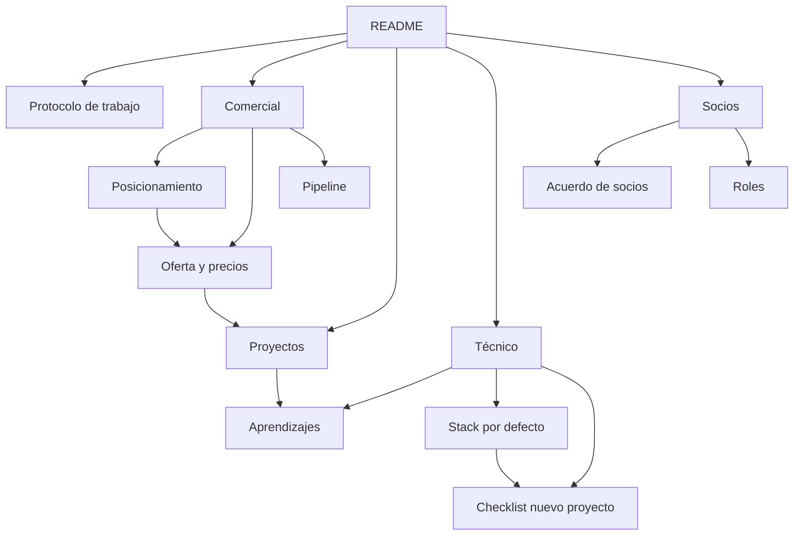

# Documentación de la consultora

Este repositorio es la fuente única de verdad de cómo trabajamos, qué vendemos y qué hemos aprendido.

Si algo importante no está aquí, no existe. Si tienes que explicar algo por segunda vez, escríbelo aquí en lugar de explicarlo mejor.

---

## Por dónde empezar

Si eres nuevo o llevas tiempo sin entrar, lee en este orden:

1. [Protocolo de trabajo](protocolo-de-trabajo.md) — cómo operamos, cómo se mueve el código, cómo nos comunicamos
2. [Posicionamiento](comercial/posicionamiento.md) — qué vendemos y a quién
3. [Roles](socios/roles.md) — quién decide qué
4. [Stack por defecto](tecnico/stack-por-defecto.md) — con qué construimos

---

## Mapa del repositorio

| Carpeta | Qué contiene |
|---|---|
| [`decisiones/`](decisiones/) | ADRs de la consultora: decisiones que costaron discusión y no queremos reabrir |
| [`comercial/`](comercial/) | Posicionamiento, oferta, precios, pipeline y contactos |
| [`proyectos/`](proyectos/) | Una ficha por proyecto. El código y sus ADRs técnicos viven en el repo de cada proyecto |
| [`tecnico/`](tecnico/) | Stack, checklists y aprendizajes acumulados |
| [`plantillas/`](plantillas/) | Formatos que reutilizamos para no empezar de cero |
| [`socios/`](socios/) | Acuerdo entre nosotros y reparto de responsabilidades |

---

## Reglas de este repositorio

**1. Todo cambio va por Pull Request.** Nada se edita directo en `main`, ni siquiera una corrección de dedo. Al menos una persona más aprueba.

**2. Enlaces en Markdown estándar, nunca wikilinks.** Se escribe `[texto](carpeta/archivo.md)`, no `[[archivo]]`. Los wikilinks se ven rotos en GitHub y este repo tiene que leerse bien en los dos lados.

Configuración obligatoria en Obsidian (Ajustes, Archivos y enlaces):
- "Usar `[[Wikilinks]]`": **desactivado**
- "Formato de enlace nuevo": **Ruta relativa al archivo**

**3. Obsidian es un visor, no el formato.** Si un archivo no se ve bien en GitHub, está mal escrito. Nada de plugins de la comunidad, Dataview ni plantillas dinámicas.

**4. No duplicamos.** Los ADRs técnicos de un proyecto viven en el repo de ese proyecto, en `docs/decisions/`. Desde aquí se enlaza, nunca se copia. Dos copias de algo significa que ninguna es la verdad.

**5. Los diagramas van en Mermaid**, dentro del `.md`. Nada de imágenes exportadas: se desactualizan y nadie las regenera.

**6. Un diagrama desactualizado desinforma.** Si no vas a mantenerlo, no lo hagas.

---

## Presupuesto de este repositorio

Este repo es una herramienta, no un proyecto.

Montarlo y llenarlo por primera vez: **8 horas de equipo, máximo.** Después de eso solo se escribe cuando hay algo real que documentar.

Escribir documentación se siente productivo, no tiene rechazo posible y no genera ingresos. Es el proyecto perfecto para procrastinar los cuatro juntos. Si en una semana el repo avanzó más que el producto, algo va mal.
