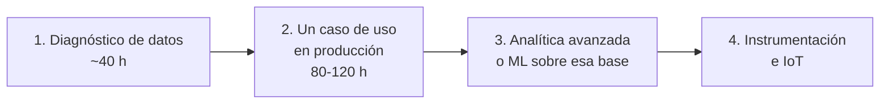

# Oferta y precios

**Estado:** borrador
**Relacionado:** [Posicionamiento](posicionamiento.md), [Plantilla de propuesta](../plantillas/propuesta-comercial.md)

---

## La escalera de oferta

Cada peldaño vende el siguiente. Todos caben en nuestro presupuesto de horas.

### Peldaño 1. Diagnóstico de datos

**Duración:** 2 a 3 semanas. **Esfuerzo:** ~40 horas.

Qué se entrega:
- Inventario de qué datos se generan hoy y dónde mueren
- Mapa de 3 a 5 casos de uso, priorizados por valor y esfuerzo
- Documento y una sesión de presentación

**Para qué sirve de verdad:** es el mejor instrumento de prospección que tenemos. Es lo bastante barato como para que un contacto diga que sí sin pedir permiso a nadie, y nos da acceso y contexto que ningún competidor tiene.

### Peldaño 2. Un caso de uso en producción

**Duración:** 10 a 16 semanas a nuestro ritmo. **Esfuerzo:** 80 a 120 horas.

Se toma el caso número uno del mapa y se lleva a producción de verdad: ingesta, modelo de datos, interfaz mínima, desplegado y midiendo.

**Techo duro: 120 horas.** Si el alcance se va a 200, terminamos el año con cero proyectos cerrados y cuatro personas desmoralizadas.

### Peldaño 3. Analítica avanzada o ML

Solo tiene sentido cuando el peldaño 2 lleva meses corriendo y hay historia acumulada. Vender modelos sobre datos que no existen todavía es vender humo.

### Peldaño 4. Instrumentación e IoT

Para lo que el diagnóstico mostró que no se está midiendo. Requiere presencia física y capex del cliente, así que es tarde en la relación, no punto de entrada.

---

## Precios

**Pendiente de definir.** Lo que sí está decidido:

**No cobramos por hora.** Cobrar por hora nos castiga por ser rápidos, que es justo nuestra ventaja. Precio cerrado por entregable.

**Antes de cotizar, hay que saber tres cosas:**
1. Cuánto le cuesta hoy al cliente ese problema (horas perdidas por semana, por el costo de esas horas)
2. Quién aprueba el gasto y si hay presupuesto asignado este año
3. Qué pasa si no se resuelve en seis meses

Sin esas tres respuestas, cualquier número que digamos es una adivinanza.

**El primer proyecto puede ir barato, pero nunca gratis.** Un cliente que no paga no da retroalimentación real, no prioriza el proyecto y no genera referido. Si hace falta un descuento, se pone explícito como "precio de primer cliente" y con fecha de vencimiento, para que el siguiente no lo herede.

---

## Perfiles de cliente

| Perfil | Ventaja | Riesgo |
|---|---|---|
| Startup | Decide rápido, poca burocracia | Presupuesto volátil, prioridades que cambian cada trimestre, puede desaparecer a media obra |
| Empresa mediana con operación física | Presupuesto real, problemas caros | Ciclo de venta largo, más interlocutores |
| Corporativo | Contratos grandes | Compras, proveedores registrados, seis meses de ciclo. No es para nosotros todavía |

Una startup es aceptable como primera repetición de aprendizaje. No es cimiento de negocio.

---

## Pendiente de decidir

- [ ] Precio de lista del diagnóstico
- [ ] Rango de precio del peldaño 2
- [ ] Moneda de facturación (tres países, ver [acuerdo de socios](../socios/acuerdo.md))
- [ ] Condiciones de pago: ¿anticipo, hitos, contra entrega?
