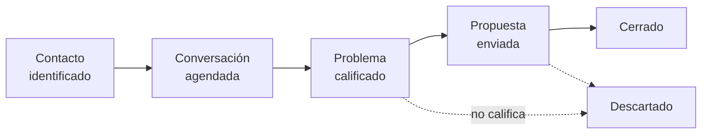

# Pipeline comercial

**Se actualiza:** en cada junta quincenal
**Relacionado:** [Contactos](contactos.md), [Oferta y precios](oferta-y-precios.md)

---

## Etapas

| Etapa | Qué significa | Cómo se avanza |
|---|---|---|
| Contacto identificado | Alguien de nuestra red en una empresa con operación real | Pedir 45 minutos |
| Conversación agendada | Hay fecha en el calendario | Hacer las preguntas de calificación |
| Problema calificado | Pasó las 5 preguntas de abajo | Mandar propuesta |
| Propuesta enviada | Hay número y alcance por escrito | Seguimiento a 7 días |
| Cerrado | Firmado y con anticipo | Abrir ficha en [proyectos/](../proyectos/) |

---

## Las 5 preguntas de calificación

Se hacen en la primera llamada. No se presenta nada, solo se pregunta.

1. **¿Qué herramientas evaluaron para esto y por qué no funcionaron?** Si la respuesta es "ninguna", no hay problema real todavía, solo una idea. Y en cuanto alguien googlee, competimos contra un SaaS de 60 dólares al mes.
2. **¿Qué tiene su proceso que no cabe en una herramienta estándar?** Aquí está nuestro terreno: procesos feos, específicos, con reglas raras, donde ningún producto entra porque el mercado es demasiado chico.
3. **¿Cuánto tiempo pierden hoy a la semana en esto y cuánto vale ese tiempo?** Sin esto no hay forma de poner precio.
4. **¿Quién aprueba un gasto de este tipo y hay presupuesto asignado este año?** Si nuestro interlocutor no firma y no sabe quién firma, no hay operación.
5. **¿Qué pasa si esto no se resuelve en seis meses?** Si la respuesta es "nada grave", no van a comprar.

**Regla:** si las preguntas 2 y 4 no tienen respuesta sólida, se descarta. Es una lección barata.

---

## Cómo leemos el interés

El interés es gratis. Nadie dice que no a una idea bien contada que no le cuesta nada.

| Señal | Qué vale |
|---|---|
| "Suena muy interesante" | Nada |
| Un tercero nos cuenta que a alguien le interesó | Casi nada |
| Nos agendan 45 minutos | Algo |
| Nos presentan a quien firma | Bastante |
| Nos preguntan cuánto cuesta y para cuándo | Mucho |
| Pagan un anticipo | Todo |

---

## Estado actual

| Contacto | Empresa | Etapa | Dueño | Última acción | Próximo paso |
|---|---|---|---|---|---|
| [ ] | Startup de RH | Contacto identificado | [ ] | Interés de la líder de RH, de tercera mano | Agendar los 45 min y aplicar las 5 preguntas |

---

## Meta de los primeros 6 meses

- 20 personas de nuestra red contactadas
- 8 conversaciones de 45 minutos
- 2 diagnósticos vendidos
- 1 proyecto del peldaño 2 cerrado
