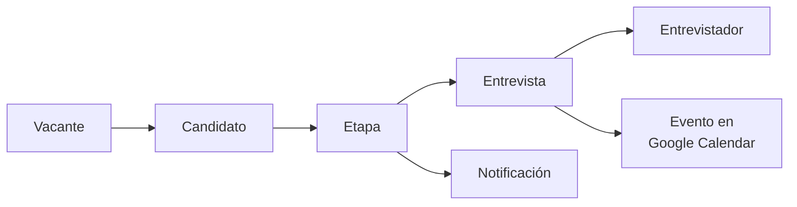

# Proyecto: sistema de seguimiento de candidatos

**Cliente:** [startup, pendiente de nombrar]
**Estado:** sin calificar
**Dueño del proyecto:** [ ] (el socio con menos experiencia, con acompañamiento)
**Repo:** [pendiente]
**Relacionado:** [Pipeline](../comercial/pipeline.md), [Checklist](../tecnico/checklist-nuevo-proyecto.md)

---

## Por qué este proyecto

**No** porque sea el mejor mercado. El seguimiento de candidatos es una de las categorías de software más saturadas que existen: alrededor del 94 por ciento de las Fortune 500 usa un ATS, más del 62 por ciento de las PyMEs ya tiene uno en la nube, y solo desde 2023 se lanzaron más de 35 productos nuevos de la categoría.

Sí porque:
1. Es la única puerta tibia que existe hoy
2. Nuestro objetivo real en los primeros seis meses es aprender el ciclo completo entre cuatro, no maximizar el primer contrato

**Es nuestra primera repetición, no la definición de nuestro nicho.**

---

## El hueco real del mercado

No es ausencia de producto. Cerca del 37 por ciento de las PyMEs reporta que los costos de implementación y la falta de personalización les limitan la adopción.

**Consecuencia:** si construimos un ATS genérico, competimos contra empresas de producto y perdemos siempre. Lo único que podemos ganar es el proceso feo y específico que ningún producto cubre.

---

## Riesgo principal, sin resolver

**¿Esta startup tiene un flujo de contratación genuinamente raro, o simplemente nunca evaluó Workable ni Recruitee?**

Si es lo segundo, el proyecto está muerto: en cuanto alguien googlee, nuestra propuesta de 120 horas compite contra 60 dólares al mes.

**Ninguna línea de código antes de contestar esto.** Ver las 5 preguntas en [pipeline](../comercial/pipeline.md).

Segundo riesgo: la líder de RH probablemente no firma. En una startup eso es el CEO o el COO, y con ellos no se ha hablado.

---

## Alcance propuesto: 100 horas

### Dentro

- Modelo de datos: vacante, candidato, etapa, entrevista, entrevistador
- Ingesta por formulario público y carga manual
- Tablero kanban por etapa, con arrastre entre columnas
- **Agendamiento contra Google Calendar:** leer disponibilidad de entrevistadores, proponer horarios, crear el evento con invitación
- Correos automáticos en tres momentos: recepción, cita agendada, rechazo
- Un dashboard: candidatos por etapa, días promedio en etapa, conversión entre etapas

### Fuera (la versión que nos hunde)

Parseo de CV con IA, scoring de candidatos, portal del candidato, multiempresa, permisos por rol, integraciones con bolsas de trabajo, app móvil.

### La pieza que vale

**El agendamiento.** Es lo que le duele a la líder de RH, es lo que ningún ATS barato hace bien contra calendarios reales, y es lo que se reutiliza en la mayoría de los proyectos que vienen después.

---

## Rebanadas verticales

Cada persona toma una completa, de la base de datos a la pantalla.

| Rebanada | App de Django | Dueño |
|---|---|---|
| Candidatos | `candidatos/` | [ ] |
| Kanban de etapas | `etapas/` | [ ] |
| Agendamiento | `agenda/` | [ ] |
| Notificaciones | `notificaciones/` | [ ] |
| Dashboard | `reportes/` | [ ] |

